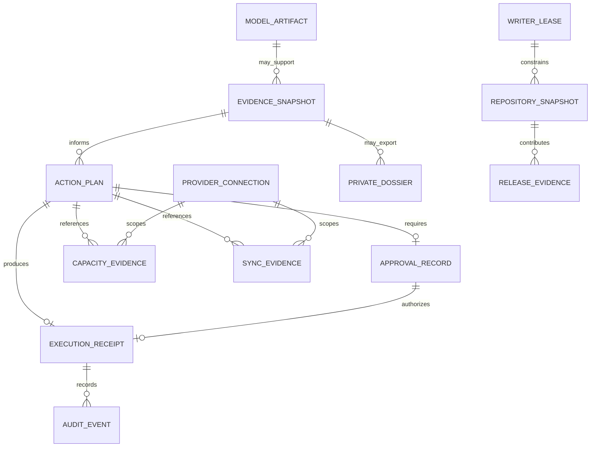

# DiskSage Data and Evidence Model

## Purpose

DiskSage is local-first and does not currently claim one authoritative relational application database. This document defines conceptual/logical entities that must remain distinct across Rust structures, typed IPC/export schemas, restricted private files, receipts, workflow artifacts, and any future persistence layer.

## Conceptual, logical, and persisted status

**No central application database is claimed by this document.** An entity in the ERD has distinct identity or authority semantics; it does not imply a SQL table with the same name exists.

| Entity | Meaning | Current persistence classification |
| --- | --- | --- |
| `evidence_snapshot` | Bounded read-only observation plus completeness/fingerprint | Logical; serialized by workflow where implemented |
| `action_plan` | Exact proposed operation, scope, blockers, fingerprints | Logical; workflow-specific structures/files where implemented |
| `approval_record` | Human approval bound to exact plan/scope/freshness | Logical; operation-specific authorization/receipt data where implemented |
| `execution_receipt` | Durable bounded result evidence for an applicable mutation | Persisted restricted local receipt where the workflow requires it |
| `provider_connection` | Purpose-bound provider/account authorization scope | Provider-specific local records; secrets not shareable |
| `capacity_evidence` | Filesystem/provider capacity observation | Logical/serialized evidence component |
| `sync_evidence` | Item/provider synchronization evidence or explicit unknown | Logical/serialized evidence component |
| `model_artifact` | Reviewed model revision, size, digest, installed/verified identity | Source-controlled spec plus local artifact |
| `private_dossier` | Explicit operator-created path-bearing evidence | Persisted local restricted file only when requested |
| `audit_event` | Bounded planning/execution/recovery event | Logical; journals/receipts/logs where implemented |
| `repository_snapshot` | Source head, live base, checks/reviews/runs at a decision point | Software-delivery evidence, not runtime authorization |
| `release_evidence` | Integrated source, artifacts, SBOM/provenance, acceptance | GitHub/release evidence, not local product DB state |
| `writer_lease` | Repository/branch mutation ownership for autonomous maintenance | Automation/control-plane state, not product runtime authority |

## Core invariants

1. `evidence_snapshot` cannot authorize mutation by itself.
2. `action_plan` requires matching current approval and current precondition revalidation before mutation.
3. `approval_record` is single-purpose and expires; drift requires a new approval.
4. `execution_receipt` records the result and is not a reusable mutation token.
5. `capacity_evidence`, `sync_evidence`, and `provider_connection` are distinct.
6. `model_artifact` integrity proves reviewed-byte identity only.
7. `repository_snapshot` and `release_evidence` govern software delivery, not operator filesystem authority.
8. `private_dossier` is local by default.
9. `writer_lease` does not grant runtime filesystem authority and does not transfer reviews/checks between heads.

## Logical ERD

Uppercase diagram labels are visual only; canonical logical names are the lowercase `snake_case` names above.

## `evidence_snapshot`

Minimum logical attributes depend on workflow and may include:

- `evidence_schema_version`;
- `observed_at_utc`;
- bounded/redacted scope identity;
- `evidence_fingerprint`;
- completeness state;
- stable issue/blocker codes;
- resource-bound outcomes.

A shareable snapshot need not contain exact local coordinates.

## `action_plan`

A mutation-bearing plan binds the operation class, source/candidate identity, destination when applicable, provider/account scope when applicable, exact evidence fingerprints, collision/precondition results, expected units/bytes, backend-authored confirmation phrase, schema/compiler version, and explicit blockers/unknowns.

A plan is not approval.

## `approval_record`

Logical attributes include attributed human identity, rationale, exact phrase, exact plan/action fingerprint, applicable scope, issue time, expiry time, and monotonic elapsed-time evidence when issue/consumption occur in one process.

Approval is rejected after expiry, clock inconsistency, drift, or scope mismatch.

## `execution_receipt`

A receipt records the exact authorized operation: plan/approval identity, execution timing, created/adopted/retained object result, applicable content/filesystem identity, recovery outcome, provider proof classification, and stable result code.

A receipt does not claim synchronization or reclaimability unless the executed operation proved it.

## `provider_connection`

Logical identity includes provider type, bounded account/root scope, authorization version, and local record integrity. Bearer values/secrets are never part of a shareable envelope.

## `capacity_evidence`

Records observation source/time, quota/available values where known, units, completeness, reserve policy where applicable, and fingerprint. Unknown is never coerced to zero.

## `sync_evidence`

Records which authority supplied the observation, exact item/copy fingerprint, observation time, and completeness. Provider-client presence alone is not complete sync evidence.

## `model_artifact`

Logical fields include reviewed upstream repository, immutable revision, artifact name, expected bytes, expected SHA-256, license evidence, local identity, installation validation, and load validation. Current protected main implements both installation and execution-boundary integrity checks.

## `repository_snapshot`

Repository automation keeps separate:

- exact source head;
- independently resolved live base tip;
- check evidence;
- commit-status evidence;
- formal review evidence;
- automated reviewer/scanner evidence;
- workflow run/attempt identity;
- branch/ruleset policy state.

No field substitutes for another.

## `release_evidence`

Binds the exact integrated source to build inputs, tests/checks, review/governance evidence, artifact digests, package metadata, SBOM/provenance, compatibility, migration/rollback/recovery evidence, and release acceptance.

## Privacy classes

### Shareable

Version identifiers, path-free counts/aggregates, stable action/blocker/result codes, fingerprints, capability flags, explicit unknown/incomplete state.

### Private

Exact paths, provider-local identifiers, archive offsets/ranges, detailed digests/collision coordinates, operator receipts, or other source lineage that is unnecessary for a cross-service purpose.

## Future relational persistence rule

If relational persistence is introduced, physical objects use at least two descriptive words in `snake_case` by default. A migration must state which conceptual entities become persisted, ownership/tenant scope, retention, encryption, indexes/constraints, forward migration, rollback or irreversible boundary, and compatibility evidence. This ERD is not physical DDL.