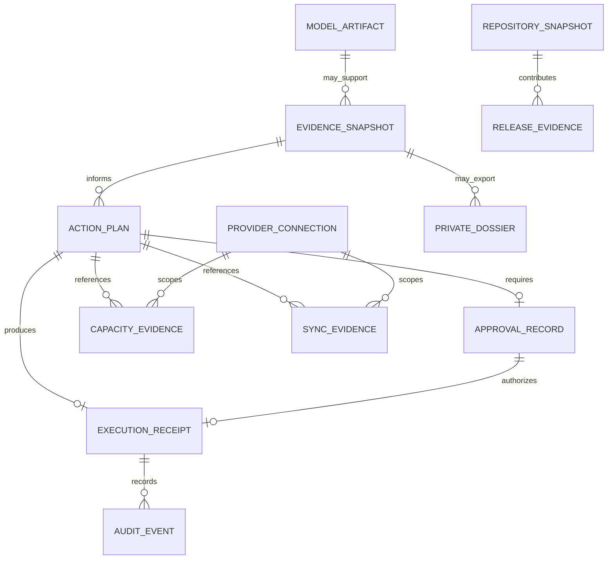

# DiskSage Data and Evidence Model

## Purpose

DiskSage is local-first and does not currently claim one authoritative relational application database. This document therefore defines the conceptual and logical entities that must remain distinct across Rust structures, IPC/export schemas, restricted private evidence files, receipts, workflow artifacts, and any future persistence layer.

## Conceptual, logical, and persisted status

**No central application database is claimed by this document**. An entity appearing in the ERD means the concept has distinct identity/authority semantics; it does not assert that a SQL table with the same name exists today.

| Entity | Meaning | Current persistence classification |
| --- | --- | --- |
| `evidence_snapshot` | Bounded read-only observation and its fingerprint | Conceptual/logical; serialized in workflow-specific evidence where implemented |
| `action_plan` | Exact proposed operation, scope, blockers, destination, fingerprints | Conceptual/logical; workflow-specific plan files/structures where implemented |
| `approval_record` | Human-attributed approval bound to exact plan/scope/freshness | Conceptual/logical; embedded in operation-specific authorization/receipt structures where implemented |
| `execution_receipt` | Immutable or create-new operation outcome evidence | Persisted as restricted local receipt in applicable workflows |
| `provider_connection` | Local provider/account authorization material and scope | Logical; provider-specific local connection/token documents where implemented |
| `capacity_evidence` | Provider or filesystem capacity observation | Logical; serialized evidence/plan component where implemented |
| `sync_evidence` | Item/provider synchronization proof or incomplete state | Logical; serialized evidence/plan component where implemented |
| `model_artifact` | Reviewed model identity: revision, byte count, digest, local state | Source-controlled specification plus local artifact; installation/load hardening is active PR work |
| `private_dossier` | Explicit operator-created path-bearing private evidence | Persisted local file only when requested by a supported CLI/workflow |
| `audit_event` | Bounded event about planning/execution/recovery | Conceptual/logical; journals/receipts or workflow logs where implemented |
| `release_evidence` | Source/check/review/package/SBOM/provenance identity | GitHub/release artifact evidence, not a local product database row |
| `repository_snapshot` | Exact source head, live base tip, reviews/checks/runs at one decision point | Automation evidence; not product runtime authorization |

## Core invariants

1. An `evidence_snapshot` cannot authorize a mutation by itself.
2. An `action_plan` becomes executable only with a matching current `approval_record` and current precondition revalidation.
3. An `approval_record` is single-purpose and expires; it does not refresh itself after plan drift.
4. An `execution_receipt` records what occurred and cannot be reused as a generic future mutation token.
5. `capacity_evidence`, `sync_evidence`, and `provider_connection` are separate. None is a substitute for another.
6. A `model_artifact` digest proves reviewed-byte identity only; it does not prove model behavioral safety.
7. A `repository_snapshot` and `release_evidence` govern source/release decisions, not local filesystem operator authority.
8. A `private_dossier` remains local by default and must not silently cross a CWL service boundary.

## Logical relationships

The diagram uses uppercase labels for readability; canonical logical object names are the lowercase `snake_case` names in the tables above.

## Entity contracts

### `evidence_snapshot`

Minimum logical fields vary by workflow but include:

- `evidence_schema_version`
- `observed_at_utc`
- bounded `scope_identifier` or redacted scope descriptor
- `evidence_fingerprint`
- completeness state
- stable issue/blocker codes
- explicit resource-bound outcomes

Private source coordinates are not required in the shareable representation.

### `action_plan`

A mutation-bearing plan binds:

- `action_plan_id` or stable plan fingerprint;
- operation class;
- source/candidate identity;
- destination identity when applicable;
- provider/account scope when applicable;
- exact evidence fingerprints;
- collision/precondition results;
- expected byte/unit totals;
- backend-authored confirmation phrase;
- schema/compiler version;
- explicit blockers and unknowns.

A plan is not an approval.

### `approval_record`

The approval contract includes:

- attributed human identity;
- rationale;
- exact confirmation phrase;
- exact plan/action fingerprint;
- exact applicable scope;
- `issued_at_utc`;
- `expires_at_utc`;
- monotonic elapsed-time evidence when issue and consumption occur in one process.

Approval is rejected after expiry, clock inconsistency, plan drift, or scope mismatch.

### `execution_receipt`

The receipt records only the authorized operation. It may include exact local detail only when stored in the approved restricted private location. Logical fields include:

- operation identifier and schema version;
- plan/approval fingerprint;
- execution start/end evidence;
- created/adopted/retained object result;
- content or filesystem identity where relevant;
- rollback/recovery outcome;
- provider proof classification where relevant;
- stable result code.

The receipt must not claim provider synchronization or reclaimability when the executed operation did not prove it.

### `provider_connection`

Provider connection state is purpose-bound and provider-specific. Secrets or bearer values are never represented in a shareable evidence envelope. Logical identity includes provider type, bounded account/root scope, authorization version, and local record integrity.

### `capacity_evidence`

Capacity observations preserve source, observation time, relevant quota/available values, unit semantics, completeness, reserve policy where applicable, and a fingerprint. Unknown is not zero.

### `sync_evidence`

Synchronization evidence identifies which authority supplied the observation (native File Provider, provider API, local queue, or other reviewed source), what exact item/copy fingerprint it covers, observation time, and whether evidence is complete. Local provider-client presence is never represented as complete sync evidence.

### `model_artifact`

Logical fields include reviewed upstream repository, immutable revision, artifact name, expected bytes, expected SHA-256, license evidence, local path classification, installation state, and load-verification state. Active PRs #141/#142 strengthen these boundaries and remain unintegrated until their gates pass.

### `repository_snapshot`

Automation requires explicit separation of:

- exact source head revision;
- independently resolved current base revision;
- check evidence;
- status evidence;
- formal review evidence;
- automated-review/scanner evidence;
- workflow run/attempt identity;
- branch/ruleset policy state.

No field implies another evidence class.

### `release_evidence`

A release evidence set binds the exact integrated source revision to build inputs, checks, review/approval, artifacts, checksums, package metadata, SBOM/provenance, migration/rollback evidence, and release acceptance. PR #138 proposes stronger artifact attestation but remains active stacked work.

## Privacy classes

### Shareable evidence

May contain:

- version identifiers;
- path-free counts/aggregates;
- stable action or blocker codes;
- cryptographic fingerprints;
- capability flags;
- bounded status summaries.

### Private evidence

May contain:

- exact local paths;
- provider-local identifiers;
- archive offsets/ranges;
- detailed digests/collision coordinates;
- operator receipts or source lineage.

Private evidence requires explicit local destination and access controls. It is not uploaded by default.

## Future relational persistence rule

If a database is introduced, physical objects must use at least two descriptive words in `snake_case` by default. Candidate names derived from this model include `evidence_snapshot`, `action_plan`, `approval_record`, `execution_receipt`, `provider_connection`, `capacity_evidence`, `sync_evidence`, `model_artifact`, `audit_event`, and `release_evidence`.

A future migration must explicitly document which conceptual entities become persisted, tenant/ownership scope, retention, encryption, indexes/constraints, forward migration, rollback, and compatibility. The conceptual ERD must not be treated as physical DDL until such a migration is reviewed and integrated.