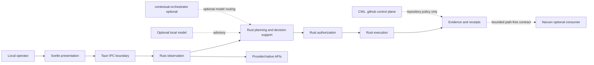
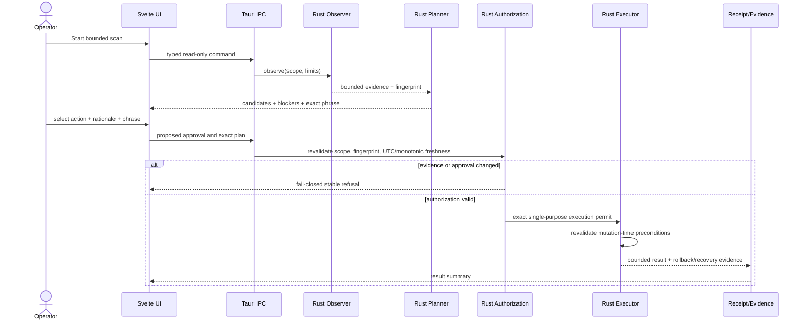
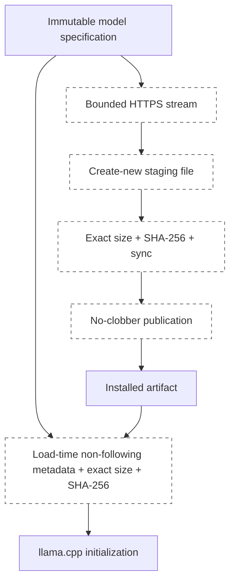
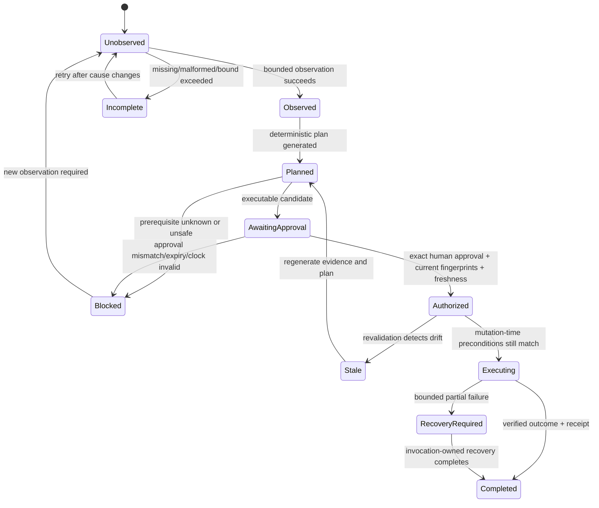
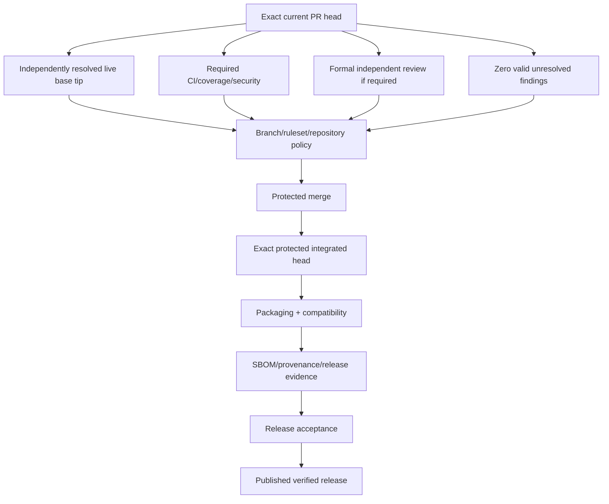
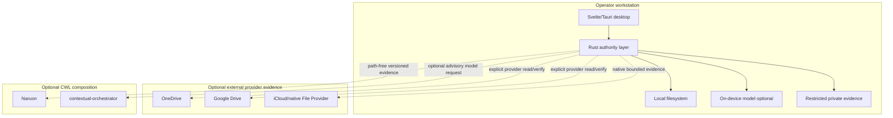

# DiskSage UML and Architecture Diagrams

## Evidence status

These diagrams describe the intended architecture represented by the current source and active architecture PRs. Labels `active_pr` and `planned` are not protected-main implementation claims.

## Component and bounded-context view



The `.github` control plane governs repository evidence, not local runtime authorization.

## Standard scan, recommend, approve, execute sequence



## Cloud copy and existing-copy adoption authority flow

```mermaid
sequenceDiagram
    actor Operator
    participant Scanner as Local/Cloud Evidence
    participant Capacity as Capacity Evidence
    participant Sync as Sync Evidence
    participant Planner as Copy Planner
    participant Review as Human Review
    participant Executor as Copy/Adoption Executor
    participant Receipt as Restricted Receipt

    Scanner->>Planner: source lineage + destination/provider scope
    Capacity->>Planner: capacity observation
    Sync->>Planner: item/provider state or unknown
    Planner-->>Review: exact immutable candidate plan + blockers
    Review-->>Planner: approver + rationale + exact confirmation
    Planner->>Executor: current plan + approval
    Executor->>Executor: refresh source/destination/provider preconditions
    alt drift or incomplete authority
        Executor-->>Review: refuse; new plan/approval required
    else valid copy/adoption
        Executor->>Receipt: create-new/no-clobber result evidence
        Receipt-->>Operator: bounded result
    end
```

Capacity, runtime presence, copy completion, provider sync, and local eviction permission remain distinct states.

## Model download and load integrity flow



Installation hardening is active PR #141. Load-time re-verification is active stacked PR #142. The diagram is architecture intent until those PRs are integrated.

## Runtime evidence and authority state machine



## Repository merge and release authority flow



Queued, stale, predecessor-head, status-only, or synthetic-only evidence never enters the success path.

## Deployment topology



A network or CWL outage degrades the corresponding optional capability; it does not transfer remote authority into the local runtime.

## Documentation maintenance rule

When a code or ADR change modifies a bounded context, state transition, authority edge, persistence relationship, deployment boundary, or release gate, update this file or explicitly record why the diagrams remain accurate. `src/lib/architectureDocumentation.test.ts` keeps the canonical diagram document discoverable.