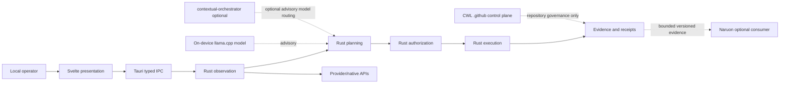
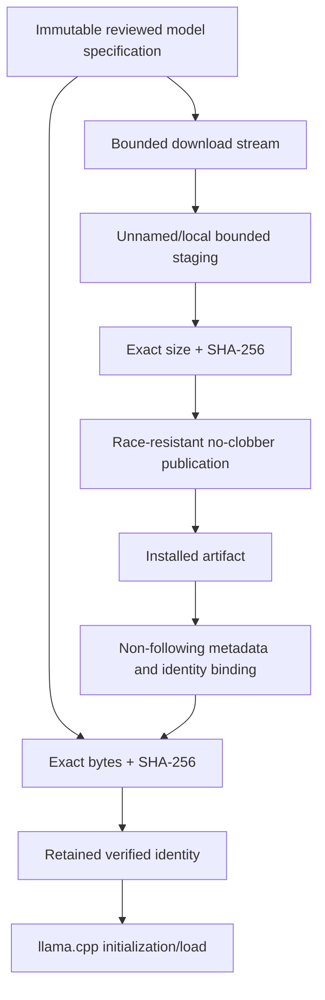
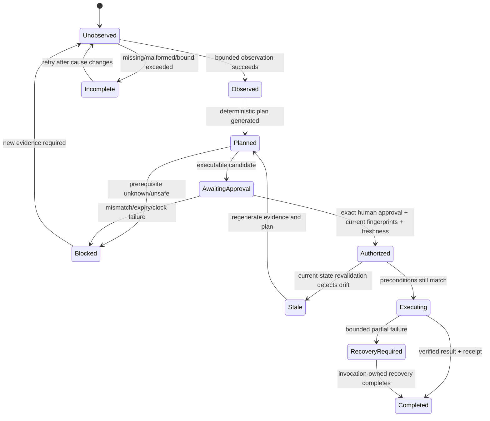
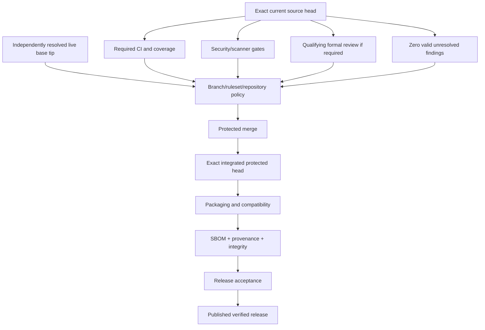
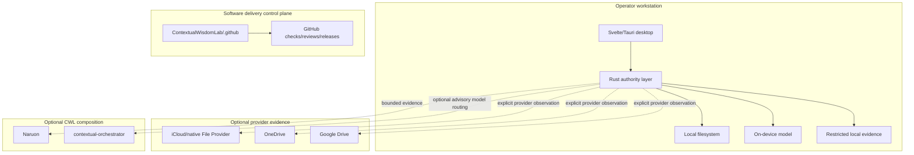

# DiskSage UML and Architecture Diagrams

## Evidence status

These diagrams document the canonical architecture and authority transitions. They do not claim that a planned capability is implemented merely because it appears in a diagram. Runtime implementation status is cross-checked in `docs/TRACEABILITY.md`.

## Component and bounded-context view



The organization control plane governs software integration evidence; it does not authorize a local filesystem mutation.

## Standard scan, recommend, approve, execute sequence

```mermaid
sequenceDiagram
    actor Operator
    participant UI as Svelte UI
    participant IPC as Tauri IPC
    participant Obs as Rust Observer
    participant Plan as Rust Planner
    participant Auth as Rust Authorization
    participant Exec as Rust Executor
    participant Rec as Receipt/Evidence

    Operator->>UI: Start bounded observation
    UI->>IPC: typed read-only command
    IPC->>Obs: observe(scope, limits)
    Obs-->>Plan: evidence + completeness + fingerprint
    Plan-->>UI: candidates + blockers + exact phrase
    Operator->>UI: choose action + rationale + phrase
    UI->>IPC: exact plan + proposed approval
    IPC->>Auth: validate scope, fingerprints, approval, clock
    alt invalid, stale, expired, incomplete
        Auth-->>UI: stable fail-closed refusal
    else current authorization
        Auth->>Exec: single-purpose execution permit
        Exec->>Exec: revalidate mutation-time preconditions
        alt drift or collision
            Exec-->>UI: fail closed; fresh plan required
        else exact operation succeeds/fails boundedly
            Exec-->>Rec: result + recovery evidence
            Rec-->>UI: bounded result
        end
    end
```

## Cloud copy/adoption evidence flow

```mermaid
sequenceDiagram
    actor Operator
    participant Local as Local evidence
    participant Provider as Provider evidence
    participant Plan as Rust planner
    participant Review as Human review
    participant Exec as Rust executor
    participant Receipt as Restricted receipt

    Local->>Plan: source lineage + destination observation
    Provider->>Plan: scope + capacity/sync evidence or unknown
    Plan-->>Review: exact plan + blockers + confirmation phrase
    Review-->>Plan: approver + rationale + exact phrase
    Plan->>Exec: current plan + approval
    Exec->>Exec: revalidate source/destination/provider state
    alt drift or incomplete authority
        Exec-->>Operator: refuse; regenerate evidence/approval
    else authorized copy/adoption
        Exec->>Receipt: no-clobber result + bounded evidence
        Receipt-->>Operator: result without automatic eviction claim
    end
```

Provider runtime presence, capacity, copy completion, synchronization, remote durability, and local eviction permission remain distinct.

## Model installation and execution integrity flow



The integrated contract verifies the artifact both before installation acceptance and again immediately before execution; the model remains advisory after integrity admission.

## Runtime evidence and authority state machine



## Repository merge and release authority flow



Older-head, predecessor, synthetic-only, queued, skipped-required, or status-only evidence never enters the success path.

## Work-conserving maintenance sequence

```mermaid
sequenceDiagram
    participant Loop as DiskSage maintainer loop
    participant GitHub as GitHub live state
    participant PR as Current PR lane
    participant Other as Other safe lane

    Loop->>GitHub: refetch all PRs/issues/main/checks/reviews
    Loop->>PR: choose highest-value safe action
    alt PR becomes waiting or externally blocked
        PR-->>Loop: defer exact head/run identity
        Loop->>Other: immediately execute another safe action
    else mutation succeeds
        PR-->>Loop: new exact head/state
        Loop->>GitHub: refetch affected evidence
    end
    Loop->>GitHub: fresh whole-queue exit sweep
    alt any safe work remains
        GitHub-->>Loop: continue queue
    else no safe work or practical run budget exhausted
        GitHub-->>Loop: end this finite invocation
    end
```

A reviewer/check/provider wait is branch/action-local, not a run-wide stop signal.

## Deployment topology



## Diagram maintenance rule

A change to bounded contexts, authority edges, lifecycle/state transitions, persistence, deployment, model/provider trust, or release evidence updates this file or records why the diagrams remain valid.