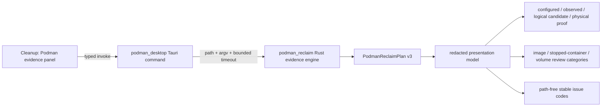

# ADR 0001: Keep Podman desktop integration read-only and evidence-bound

- **Status:** Accepted
- **Date:** 2026-08-05
- **Decision owners:** DiskSage maintainers
- **Related issue:** #107

## Context

DiskSage already has a headless Rust evidence engine that observes Podman machine configuration,
raw-image logical and host-allocated bytes, guest filesystem counters, Podman store counters,
logical image/container/volume candidates, an exact redacted unused-image candidate-set fingerprint,
and bounded issue codes. The desktop product did not expose that evidence, so buyers could not review
Podman storage pressure in the same Cleanup workspace as other storage evidence.

A desktop integration must not turn diagnostic evidence into cleanup authority. Podman-reported
`reclaimable_bytes` can include shared layers and guest-visible candidates, while a sparse VM image and
host filesystem allocation make actual host physical reclaim a separate before/after observation. The
same report also contains local machine names and filesystem paths that are useful on the device but
must not enter telemetry, analytics, remote logs, or support bundles.

## Decision

DiskSage will expose a **read-only Podman evidence panel** through a narrow Tauri command and a
separate frontend module. The desktop adapter invokes the existing Rust probe with an executable path
and argv values; it never constructs a shell command. The integration has no prune, remove, machine
stop/start, VM deletion, TRIM, or raw-image mutation operation.

### Evidence semantics

The UI renders the following classes separately:

1. **Configured:** virtual disk capacity selected in Podman configuration.
2. **Observed:** raw-image logical bytes, host allocated blocks, guest filesystem counters, and graph
   root counters.
3. **Logical candidate:** image, stopped-container, and volume candidate bytes reported by Podman.
4. **Physical proof:** actual host physical reclaim, which remains `null` and is displayed as
   `미검증` until a future before/after host free-space protocol proves it.

Image, stopped-container, and volume candidates remain separate categories. A future mutation workflow
would require a distinct human approval for each category; this ADR does not authorize or implement
that workflow.

### Privacy and logging boundary

The backend report may contain machine names, raw-image paths, and graph-root paths as **local-only**
operator evidence. The desktop panel does not render those identifiers. Detailed issue strings are
reduced to stable `[a-z0-9-]` codes before presentation. The integration does not call logging,
analytics, telemetry, or remote support APIs.

The exact unused-image candidate set is represented only by its SHA-256 fingerprint. Image IDs, tags,
and account-local paths are not added to the frontend contract.

### Modularity

- `podman_reclaim` remains the standalone headless evidence engine and CLI-compatible module.
- `podman_desktop` is a narrow Tauri adapter with an injected probe seam for deterministic tests.
- `podmanApi.ts` is a versioned typed client contract.
- `podmanEvidence.ts` is a framework-independent redacted presentation model.
- `PodmanReclaimEvidence.svelte` is a replaceable view component consumed by Cleanup.

This split permits the evidence engine to operate independently and permits other CWL products,
including Naruon, to consume a future redacted schema adapter without depending on the DiskSage UI.

## Verification contract

The change is mergeable only when the exact PR head proves:

- Rust unit tests for default and explicit machine dispatch;
- TypeScript API invocation tests;
- statement and branch coverage for every new presentation branch;
- server-rendered Svelte behavior tests for complete and partial evidence;
- negative assertions proving that machine names and paths are absent from rendered HTML;
- `svelte-check`, production frontend build, Rust tests, SAST, dependency/security scans, and release
  packaging;
- no new destructive Podman command or raw-image mutation path.

## Alternatives considered

### Reuse the superseded monolithic Cleanup implementation

Rejected. It mixed the headless engine, desktop command, frontend types, and UI in a broad patch and
rendered local machine/path values directly. The modular adapter and redacted view model are easier to
test and safer to reuse.

### Display a single “reclaimable” total

Rejected. It would conflate logical candidates with host physical proof and could mislead users about
actual free-space recovery.

### Add prune controls beside the evidence

Rejected. Evidence collection and mutation authority require different threat models, approval records,
rollback expectations, and acceptance tests.

## Consequences

The buyer gains a reviewable Podman storage diagnosis without a destructive action surface. The UI is
more explicit than a single headline total, but that additional detail is necessary to preserve the
meaning of configured, observed, logical-candidate, and physically verified values.

A later ADR is required before any Podman mutation action is introduced.

## References — APA 7th

International Organization for Standardization, & International Electrotechnical Commission. (2024).
*ISO/IEC 27040:2024 Information technology—Security techniques—Storage security* (2nd ed.).
https://www.iso.org/standard/80194.html

National Institute of Standards and Technology. (2025). *Security and privacy controls for information
systems and organizations* (NIST SP 800-53, Release 5.2.0). U.S. Department of Commerce.
https://csrc.nist.gov/projects/cprt/catalog

Souppaya, M., Scarfone, K., & Dodson, D. (2022). *Secure software development framework (SSDF)
version 1.1: Recommendations for mitigating the risk of software vulnerabilities* (NIST SP 800-218).
National Institute of Standards and Technology. https://doi.org/10.6028/NIST.SP.800-218
